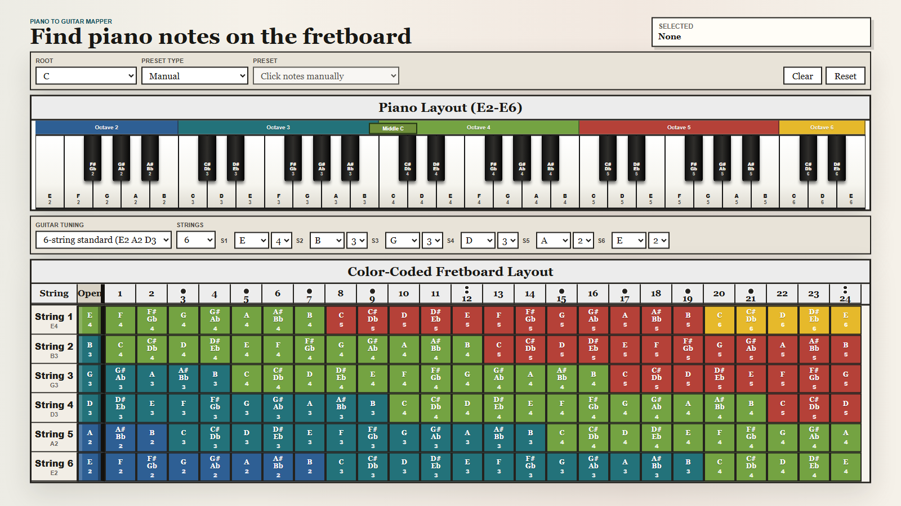

# Piano to Guitar Mapper

A static browser app for translating piano notes to guitar fretboard positions, including note names and octaves.

Live app: https://enemycube.github.io/Piano-to-Guitar/



## Features

- Dynamic piano range based on the selected guitar tuning.
- Guitar fretboard display from open strings through fret 24.
- Standard, drop, 7-string, and 8-string tuning presets.
- Custom tuning controls for 6, 7, or 8 strings.
- Note and octave labels on every piano key and fretboard cell.
- Chord and scale presets for quick pitch-class mapping.
- Exact-note selection with lighter highlights for the same note in other octaves.
- No build step, dependencies, or server required.

## Use Locally

No install or build step is required. The app is plain HTML, CSS, and JavaScript.

### Download from GitHub

1. Open the repository page on GitHub.
2. Click the green `Code` button.
3. Choose `Download ZIP`.
4. Extract the ZIP file somewhere on your computer.
5. Open the extracted folder.
6. Double-click `index.html`, or right-click it and choose your browser.

### Clone with Git

If you have Git installed:

```bash
git clone https://github.com/enemycube/Piano-to-Guitar.git
cd Piano-to-Guitar
```

Then open `index.html` directly in a browser.

Because the app has no external dependencies, it also works offline after the files are downloaded.

## Project Files

- `index.html` - app structure and controls.
- `styles.css` - chart layout, responsive scaling, and visual styling.
- `app.js` - note math, tuning logic, selection state, and rendering.
- `docs/` - README screenshots.
