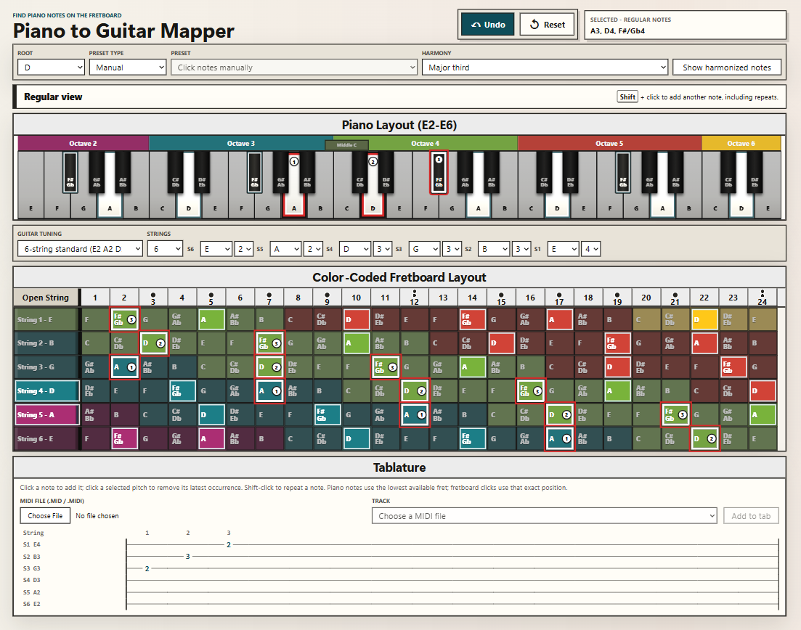

# Piano to Guitar Mapper

A static browser app for translating piano notes to guitar fretboard positions, including note names and octaves.

Live app: https://enemycube.github.io/Piano-to-Guitar/



## Features

- Dynamic piano range based on the selected guitar tuning.
- Guitar fretboard display from open strings through fret 24.
- Standard, drop, 7-string, and 8-string tuning presets.
- Custom tuning controls for 6, 7, or 8 strings.
- Note and octave labels on every piano key and fretboard cell.
- Chord and scale presets for quick pitch-class mapping.
- Exact-note selection with lighter highlights for the same note in other octaves.
- Common interval and chord harmonies, with one toggle for piano, fretboard, and tablature.
- A purple Harmonized view banner names the active harmony, with matching Harmony only badges on all three sections.
- Click piano or fretboard notes to build tablature below the fretboard, including repeated notes.
- Piano clicks choose the lowest available fret; fretboard clicks keep the chosen string and fret.
- Undo the last note or clear the sequence. Tuning changes remap the same pitches and mark unavailable notes with `?`.
- Import local MIDI files and add one track or all pitched tracks to the tab.
- No build step, dependencies, or server required.

## Use Locally

No install or build step is required. The app is plain HTML, CSS, and JavaScript.

### Download from GitHub

1. Open the repository page on GitHub.
2. Click the green `Code` button.
3. Choose `Download ZIP`.
4. Extract the ZIP file somewhere on your computer.
5. Open the extracted folder.
6. Double-click `index.html`, or right-click it and choose your browser.

### Clone with Git

If you have Git installed:

```bash
git clone https://github.com/enemycube/Piano-to-Guitar.git
cd Piano-to-Guitar
```

Then open `index.html` directly in a browser.

Because the app has no external dependencies, it also works offline after the files are downloaded.

Click a note to add it to the tab. Clicking a selected pitch removes its latest occurrence, regardless of which string you click; it stays highlighted until its final occurrence is removed. Shift-click always adds another occurrence. The numbered badges show each pitch's latest step. Chord and scale presets only highlight notes; click individual notes to add them to the tab. The tab shows note order, without rhythm notation, with string 1 at the top. When retuning, fretboard notes stay on their chosen string if playable, otherwise they use the lowest available fret.

## Generate Harmonies

1. Click piano or fretboard notes, or import MIDI to create your original sequence.
2. Choose a **Harmony**: thirds, fourths, fifths, sixths, octaves, major/minor triads, or seventh chords.
3. Click **Show harmonized notes**. Only the generated notes above each original are shown in the piano highlights, fretboard highlights, readout, and tab. Original-note highlights and tab entries are hidden until you switch back.
4. Click **Show regular notes** to return to the untouched original sequence.

For example, C4 with Major third shows only E4; C4 with Major triad shows only E4 and G4. The original C4 reappears when you switch back. Other octaves are not highlighted in harmonized mode. A pitch shared by an original and a generated harmony remains visible when it is a harmony voice. These are fixed intervals from each note, not harmonies adjusted to the selected root or scale. Changing the harmony while it is shown updates all three views immediately. Chord and scale presets also receive harmony highlights; as in regular mode, they do not create tab entries until you click notes.

In harmonized tablature, each original step remains one column containing only its harmony voices on separate strings. Original notes do not occupy strings in this view. Automatic positions fit as many harmony voices as possible and favor the lowest total frets. For equal totals, they minimize the highest fret used. Switching back restores explicit fretboard choices on their original string whenever the original pitch is playable there. This maps pitches to distinct strings; it does not guarantee a comfortable fingering. Notes that cannot fit within frets 0-24 or need an already occupied string are marked with a column `?`; the column tooltip identifies missing pitches.

While harmonies are shown, clicking a highlighted harmony removes the latest original step that generates that pitch, including all voices in that step. Clicking an unselected pitch or Shift-clicking adds the clicked pitch as an original note. MIDI imports add original notes. Undo removes the last original step and its harmony; repeated notes keep their order. Reset clears the notes, returns to regular mode, and restores the default tuning and Major third harmony.

## Import MIDI

1. Under Tablature, choose a local `.mid` or `.midi` file.
2. Select **All pitched tracks** or an individual track.
3. Click **Add to tab** to append the imported notes to your current sequence.

Standard MIDI formats 0 and 1 are supported. Notes are sorted by their start time, keeping repeated notes. Simultaneous notes appear in separate columns, ordered by track and event order. The import does not preserve rhythm, durations, rests, or simultaneous chord voicings. Generated harmonies can add voices to each imported note using the harmony controls. Drum hits on MIDI channel 10 are skipped.

Imported notes use the current tuning and lowest available fret. Notes outside its range remain in the sequence with a `?` marker. You can retune, undo notes, click selected pitches to remove occurrences, or Shift-click to append repeats. Reset also clears the selected MIDI file.

Files are read locally in your browser; no upload or installation is needed. Files up to 5 MB and 10,000 pitched notes are supported. Importing cannot bring the tab above 10,000 notes. Invalid or unsupported files leave your current tab intact.

## Project Files

- `index.html` - app structure and controls.
- `styles.css` - chart layout, responsive scaling, and visual styling.
- `app.js` - note math, tuning logic, selection state, MIDI import controls, and rendering.
- `midi.js` - local Standard MIDI File parser.
- `harmony.js` - harmony presets and simultaneous guitar string mapping.
- `docs/` - README screenshots.

## Tests

Run the dependency-free harmony and app integration checks with Node.js. Integration tests use a small DOM test double to check control events and rendered notes; they do not verify browser layout.

```bash
node --test tests/*.test.js
```
